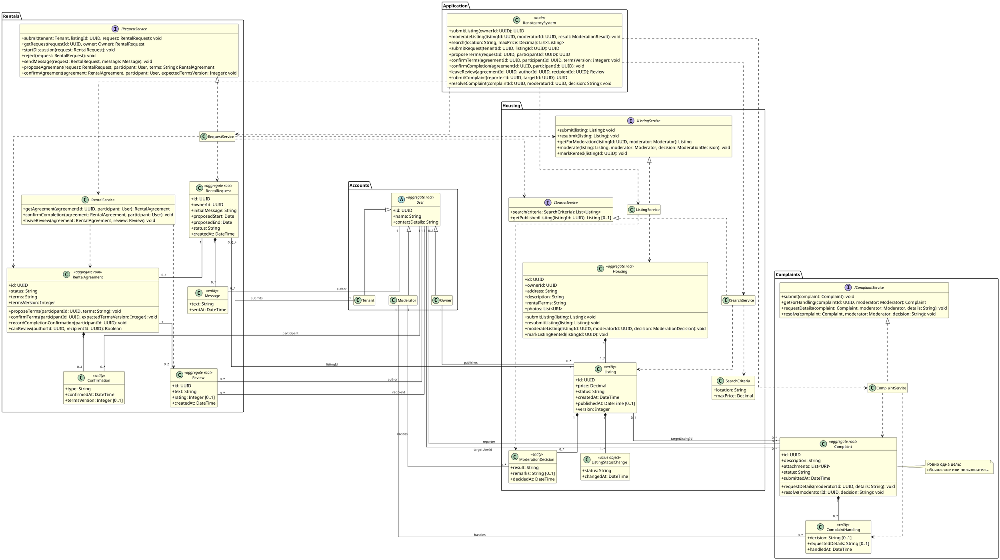

# Диаграмма классов

```plantuml
@startuml
skinparam linetype ortho
skinparam classAttributeIconSize 0
skinparam classFontSize 12
skinparam classFontName Arial
skinparam classBackgroundColor LightYellow
skinparam classBorderColor Black
skinparam shadowing false
skinparam nodesep 45
skinparam ranksep 80
skinparam ArrowFontSize 10
hide empty members

package "Accounts" {
  abstract class User <<aggregate root>> {
    +id: UUID
    +name: String
    +contactDetails: String
  }
  class Tenant
  class Owner
  class Moderator

  User <|-- Tenant
  User <|-- Owner
  User <|-- Moderator
}

package "Housing" {
  class Housing <<aggregate root>> {
    +id: UUID
    +ownerId: UUID
    +address: String
    +description: String
    +rentalTerms: String
    +photos: List<URI>
    +submitListing(listing: Listing): void
    +resubmitListing(listing: Listing): void
    +moderateListing(listingId: UUID, moderatorId: UUID, decision: ModerationDecision): void
    +markListingRented(listingId: UUID): void
  }
  class Listing <<entity>> {
    +id: UUID
    +price: Decimal
    +status: String
    +createdAt: DateTime
    +publishedAt: DateTime [0..1]
    +version: Integer
  }
  class ModerationDecision <<entity>> {
    +result: String
    +remarks: String [0..1]
    +decidedAt: DateTime
  }
  class ListingStatusChange <<value object>> {
    +status: String
    +changedAt: DateTime
  }
  class SearchCriteria {
    +location: String
    +maxPrice: Decimal
  }
  interface IListingService {
    +submit(listing: Listing): void
    +resubmit(listing: Listing): void
    +getForModeration(listingId: UUID, moderator: Moderator): Listing
    +moderate(listing: Listing, moderator: Moderator, decision: ModerationDecision): void
    +markRented(listingId: UUID): void
  }
  class ListingService
  ListingService .up.|> IListingService

  interface ISearchService {
    +search(criteria: SearchCriteria): List<Listing>
    +getPublishedListing(listingId: UUID): Listing [0..1]
  }
  class SearchService
  SearchService .up.|> ISearchService

  Housing "1" *-- "1..*" Listing
  Listing "1" *-- "0..*" ModerationDecision
  Listing "1" *-- "1..*" ListingStatusChange
  Owner "1" -- "0..*" Listing : publishes
  Moderator "1" -- "0..*" ModerationDecision : decides
  ListingService ..> Housing
  ListingService ..> ModerationDecision
  SearchService ..> SearchCriteria
  SearchService ..> Listing
}

package "Rentals" {
  class RentalRequest <<aggregate root>> {
    +id: UUID
    +ownerId: UUID
    +initialMessage: String
    +proposedStart: Date
    +proposedEnd: Date
    +status: String
    +createdAt: DateTime
  }
  class Message <<entity>> {
    +text: String
    +sentAt: DateTime
  }
  class RentalAgreement <<aggregate root>> {
    +id: UUID
    +status: String
    +terms: String
    +termsVersion: Integer
    +proposeTerms(participantId: UUID, terms: String): void
    +confirmTerms(participantId: UUID, expectedTermsVersion: Integer): void
    +recordCompletionConfirmation(participantId: UUID): void
    +canReview(authorId: UUID, recipientId: UUID): Boolean
  }
  class Confirmation <<entity>> {
    +type: String
    +confirmedAt: DateTime
    +termsVersion: Integer [0..1]
  }
  class Review <<aggregate root>> {
    +id: UUID
    +text: String
    +rating: Integer [0..1]
    +createdAt: DateTime
  }
  interface IRequestService {
    +submit(tenant: Tenant, listingId: UUID, request: RentalRequest): void
    +getRequest(requestId: UUID, owner: Owner): RentalRequest
    +startDiscussion(request: RentalRequest): void
    +reject(request: RentalRequest): void
    +sendMessage(request: RentalRequest, message: Message): void
    +proposeAgreement(request: RentalRequest, participant: User, terms: String): RentalAgreement
    +confirmAgreement(agreement: RentalAgreement, participant: User, expectedTermsVersion: Integer): void
  }
  class RentalService {
    +getAgreement(agreementId: UUID, participant: User): RentalAgreement
    +confirmCompletion(agreement: RentalAgreement, participant: User): void
    +leaveReview(agreement: RentalAgreement, review: Review): void
  }
  class RequestService
  RequestService .up.|> IRequestService

  Tenant "1" -- "0..*" RentalRequest : submits
  Listing "1" -- "0..*" RentalRequest : listingId
  RentalRequest "1" *-- "0..*" Message
  User "1" -- "0..*" Message : author
  RentalRequest "1" -- "0..1" RentalAgreement
  RentalAgreement "1" *-- "0..4" Confirmation
  User "1" -- "0..*" Confirmation : participant
  RentalAgreement "1" -- "0..2" Review
  User "1" -left- "0..*" Review : author
  User "1" -right- "0..*" Review : recipient
  RequestService ..> RentalRequest
  RequestService ..> RentalAgreement
  RentalService ..> RentalAgreement
  RentalService ..> Review
}

package "Complaints" {
  class Complaint <<aggregate root>> {
    +id: UUID
    +description: String
    +attachments: List<URI>
    +status: String
    +submittedAt: DateTime
    +requestDetails(moderatorId: UUID, details: String): void
    +resolve(moderatorId: UUID, decision: String): void
  }
  class ComplaintHandling <<entity>> {
    +decision: String [0..1]
    +requestedDetails: String [0..1]
    +handledAt: DateTime
  }
  interface IComplaintService {
    +submit(complaint: Complaint): void
    +getForHandling(complaintId: UUID, moderator: Moderator): Complaint
    +requestDetails(complaint: Complaint, moderator: Moderator, details: String): void
    +resolve(complaint: Complaint, moderator: Moderator, decision: String): void
  }
  class ComplaintService
  ComplaintService .up.|> IComplaintService

  User "1" -- "0..*" Complaint : reporter
  Listing "0..1" -down- "0..*" Complaint : targetListingId
  User "0..1" -right- "0..*" Complaint : targetUserId
  note right of Complaint
    Ровно одна цель:
    объявление или пользователь.
  end note
  Complaint "1" *-- "0..*" ComplaintHandling
  Moderator "1" -- "0..*" ComplaintHandling : handles
  ComplaintService ..> Complaint
  ComplaintService ..> ComplaintHandling
}

package "Application" {
  class RentAgencySystem <<main>> {
    +submitListing(ownerId: UUID): UUID
    +moderateListing(listingId: UUID, moderatorId: UUID, result: ModerationResult): void
    +search(location: String, maxPrice: Decimal): List<Listing>
    +submitRequest(tenantId: UUID, listingId: UUID): UUID
    +proposeTerms(requestId: UUID, participantId: UUID): UUID
    +confirmTerms(agreementId: UUID, participantId: UUID, termsVersion: Integer): void
    +confirmCompletion(agreementId: UUID, participantId: UUID): void
    +leaveReview(agreementId: UUID, authorId: UUID, recipientId: UUID): Review
    +submitComplaint(reporterId: UUID, targetId: UUID): UUID
    +resolveComplaint(complaintId: UUID, moderatorId: UUID, decision: String): void
  }
  RentAgencySystem ..> ListingService
  RentAgencySystem ..> SearchService
  RentAgencySystem ..> RequestService
  RentAgencySystem ..> RentalService
  RentAgencySystem ..> ComplaintService
}

RequestService ..> ISearchService
RequestService ..> IListingService

Housing -[hidden]down- Complaint
@enduml
```
