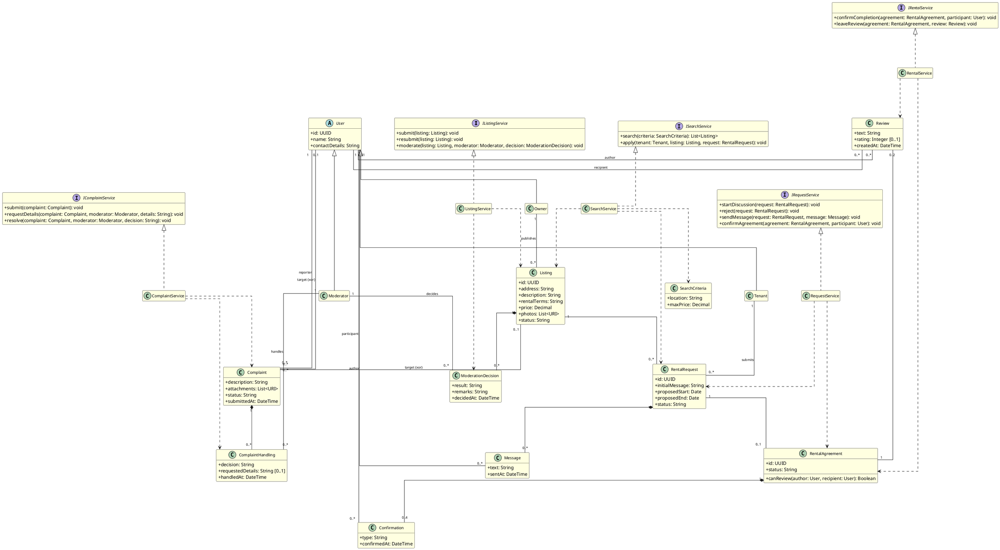

# Class Diagram

```plantuml
@startuml
skinparam linetype ortho
skinparam classAttributeIconSize 0
skinparam classFontSize 12
skinparam classFontName Arial
skinparam classBackgroundColor LightYellow
skinparam classBorderColor Black
skinparam shadowing false
skinparam nodesep 100
skinparam ranksep 120
skinparam ArrowFontSize 10
hide empty members

interface IListingService {
  +submit(listing: Listing): void
  +resubmit(listing: Listing): void
  +moderate(listing: Listing, moderator: Moderator, decision: ModerationDecision): void
}
class ListingService
ListingService .up.|> IListingService

interface ISearchService {
  +search(criteria: SearchCriteria): List<Listing>
  +apply(tenant: Tenant, listing: Listing, request: RentalRequest): void
}
class SearchService
SearchService .up.|> ISearchService

interface IRequestService {
  +startDiscussion(request: RentalRequest): void
  +reject(request: RentalRequest): void
  +sendMessage(request: RentalRequest, message: Message): void
  +confirmAgreement(agreement: RentalAgreement, participant: User): void
}
class RequestService
RequestService .up.|> IRequestService

interface IRentalService {
  +confirmCompletion(agreement: RentalAgreement, participant: User): void
  +leaveReview(agreement: RentalAgreement, review: Review): void
}
class RentalService
RentalService .up.|> IRentalService

interface IComplaintService {
  +submit(complaint: Complaint): void
  +requestDetails(complaint: Complaint, moderator: Moderator, details: String): void
  +resolve(complaint: Complaint, moderator: Moderator, decision: String): void
}
class ComplaintService
ComplaintService .up.|> IComplaintService

abstract class User {
  +id: UUID
  +name: String
  +contactDetails: String
}
class Tenant
class Owner
class Moderator

class Listing {
  +id: UUID
  +address: String
  +description: String
  +rentalTerms: String
  +price: Decimal
  +photos: List<URI>
  +status: String
}
class ModerationDecision {
  +result: String
  +remarks: String
  +decidedAt: DateTime
}
class SearchCriteria {
  +location: String
  +maxPrice: Decimal
}
class RentalRequest {
  +id: UUID
  +initialMessage: String
  +proposedStart: Date
  +proposedEnd: Date
  +status: String
}
class Message {
  +text: String
  +sentAt: DateTime
}
class RentalAgreement {
  +id: UUID
  +status: String
  +canReview(author: User, recipient: User): Boolean
}
class Confirmation {
  +type: String
  +confirmedAt: DateTime
}
class Review {
  +text: String
  +rating: Integer [0..1]
  +createdAt: DateTime
}
class Complaint {
  +description: String
  +attachments: List<URI>
  +status: String
  +submittedAt: DateTime
}
class ComplaintHandling {
  +decision: String
  +requestedDetails: String [0..1]
  +handledAt: DateTime
}

User <|-- Tenant
User <|-- Owner
User <|-- Moderator

ListingService ..> Listing
ListingService ..> ModerationDecision
SearchService ..> SearchCriteria
SearchService ..> Listing
SearchService ..> RentalRequest
RequestService ..> RentalRequest
RequestService ..> RentalAgreement
RentalService ..> RentalAgreement
RentalService ..> Review
ComplaintService ..> Complaint
ComplaintService ..> ComplaintHandling

Owner "1" -- "0..*" Listing : publishes
Listing "1" *-- "0..*" ModerationDecision
Moderator "1" -- "0..*" ModerationDecision : decides
Tenant "1" -- "0..*" RentalRequest : submits
Listing "1" -- "0..*" RentalRequest
RentalRequest "1" *-- "0..*" Message
User "1" -- "0..*" Message : author
RentalRequest "1" -- "0..1" RentalAgreement
RentalAgreement "1" *-- "0..4" Confirmation
User "1" -- "0..*" Confirmation : participant
RentalAgreement "1" -- "0..2" Review
User "1" -left- "0..*" Review : author
User "1" -right- "0..*" Review : recipient
User "1" -- "0..*" Complaint : reporter
Listing "0..1" -down- "0..*" Complaint : target {xor}
User "0..1" -right- "0..*" Complaint : target {xor}
Complaint "1" *-- "0..*" ComplaintHandling
Moderator "1" -- "0..*" ComplaintHandling : handles
@enduml
```
