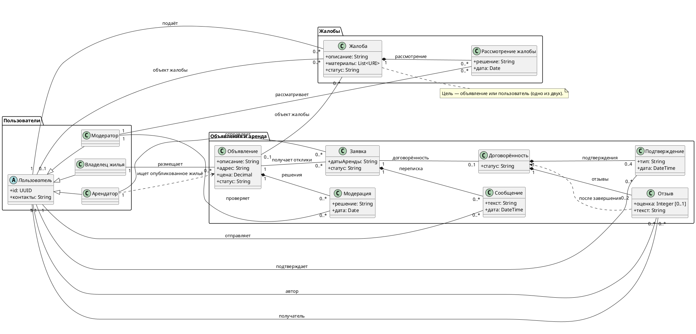

# Диаграмма классов «Нахлебная крыша»

```plantuml
@startuml
left to right direction
skinparam classAttributeIconSize 0

package "Пользователи" {
  abstract class "Пользователь" as User {
    +id: UUID
    +контакты: String
  }
  class "Арендатор" as Tenant
  class "Владелец жилья" as Owner
  class "Модератор" as Moderator

  User <|-- Tenant
  User <|-- Owner
  User <|-- Moderator
}

package "Объявления и аренда" {
  class "Объявление" as Listing {
    +описание: String
    +адрес: String
    +цена: Decimal
    +статус: String
  }
  class "Модерация" as Moderation {
    +решение: String
    +дата: Date
  }
  class "Заявка" as RentalRequest {
    +датыАренды: String
    +статус: String
  }
  class "Сообщение" as Message {
    +текст: String
    +дата: DateTime
  }
  class "Договорённость" as Agreement {
    +статус: String
  }
  class "Подтверждение" as Confirmation {
    +тип: String
    +дата: DateTime
  }
  class "Отзыв" as Review {
    +оценка: Integer [0..1]
    +текст: String
  }
}

package "Жалобы" {
  class "Жалоба" as Complaint {
    +описание: String
    +материалы: List<URI>
    +статус: String
  }
  class "Рассмотрение жалобы" as ComplaintHandling {
    +решение: String
    +дата: Date
  }
}

Tenant ..> Listing : ищет опубликованное жильё
Owner "1" -- "0..*" Listing : размещает
Listing "1" *-- "0..*" Moderation : решения
Moderator "1" -- "0..*" Moderation : проверяет

Tenant "1" -- "0..*" RentalRequest : отправляет
Listing "1" -- "0..*" RentalRequest : получает отклики
RentalRequest "1" *-- "0..*" Message : переписка
User "1" -- "0..*" Message : отправляет
RentalRequest "1" -- "0..1" Agreement : договорённость
Agreement "1" *-- "0..4" Confirmation : подтверждения
User "1" -- "0..*" Confirmation : подтверждает
Agreement "1" *-- "0..2" Review : отзывы
User "1" -- "0..*" Review : автор
User "1" -- "0..*" Review : получатель
Review ..> Agreement : после завершения

User "1" -- "0..*" Complaint : подаёт
Listing "0..1" -- "0..*" Complaint : объект жалобы
User "0..1" -- "0..*" Complaint : объект жалобы
Complaint "1" *-- "0..*" ComplaintHandling : рассмотрение
Moderator "1" -- "0..*" ComplaintHandling : рассматривает

note right of Complaint
  Цель — объявление или пользователь (одно из двух).
end note

@enduml
```
