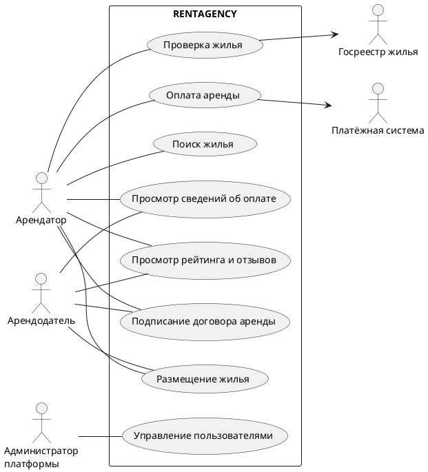

# Диаграмма прецедентов RENTAGENCY

```plantuml
@startuml
skinparam packageStyle rect
left to right direction

actor "Арендатор" as Tenant
actor "Арендодатель" as Landlord
actor "Администратор\nплатформы" as Admin

package "RENTAGENCY" {
  usecase "Поиск жилья" as SearchHousing
  usecase "Подписание договора аренды" as SignLease
  usecase "Размещение жилья" as ContactParty
  usecase "Оплата аренды" as PayRent
  usecase "Просмотр рейтинга и отзывов" as ViewReviews
  usecase "Проверка жилья" as VerifyHousing
  usecase "Управление пользователями" as ManageUsers
  usecase "Просмотр сведений об оплате" as ViewPaymentDetails
}

Tenant -- SearchHousing
Tenant -- SignLease
Tenant -- VerifyHousing
Tenant -- PayRent
Tenant -- ViewReviews
Tenant -- ContactParty
Tenant -- ViewPaymentDetails

Landlord -- SignLease
Landlord -- ContactParty
Landlord -- ViewReviews
Landlord -- ViewPaymentDetails

Admin -- ManageUsers

actor "Платёжная система" as PaymentSystem
actor "Госреестр жилья" as HousingRegistry

(PayRent) --> :PaymentSystem:
(VerifyHousing) --> :HousingRegistry:
@enduml
```

