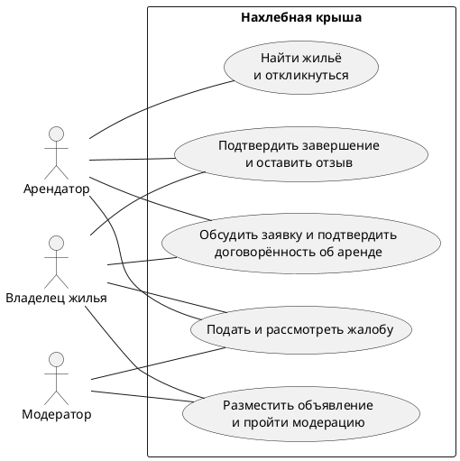

# Диаграмма прецедентов Нахлебная крыша

```plantuml
@startuml
left to right direction

actor "Арендатор" as Tenant
actor "Владелец жилья" as Owner
actor "Модератор" as Moderator

rectangle "Нахлебная крыша" {
  usecase "Разместить объявление\nи пройти модерацию" as Listing
  usecase "Найти жильё\nи откликнуться" as SearchApply
  usecase "Обсудить заявку и подтвердить\nдоговорённость об аренде" as ArrangeRental
  usecase "Подтвердить завершение\nи оставить отзыв" as CloseRental
  usecase "Подать и рассмотреть жалобу" as Complaint
}

Tenant -- SearchApply
Tenant -- ArrangeRental
Tenant -- CloseRental
Tenant -- Complaint

Owner -- Listing
Owner -- ArrangeRental
Owner -- CloseRental
Owner -- Complaint

Moderator -- Listing
Moderator -- Complaint
@enduml
```
