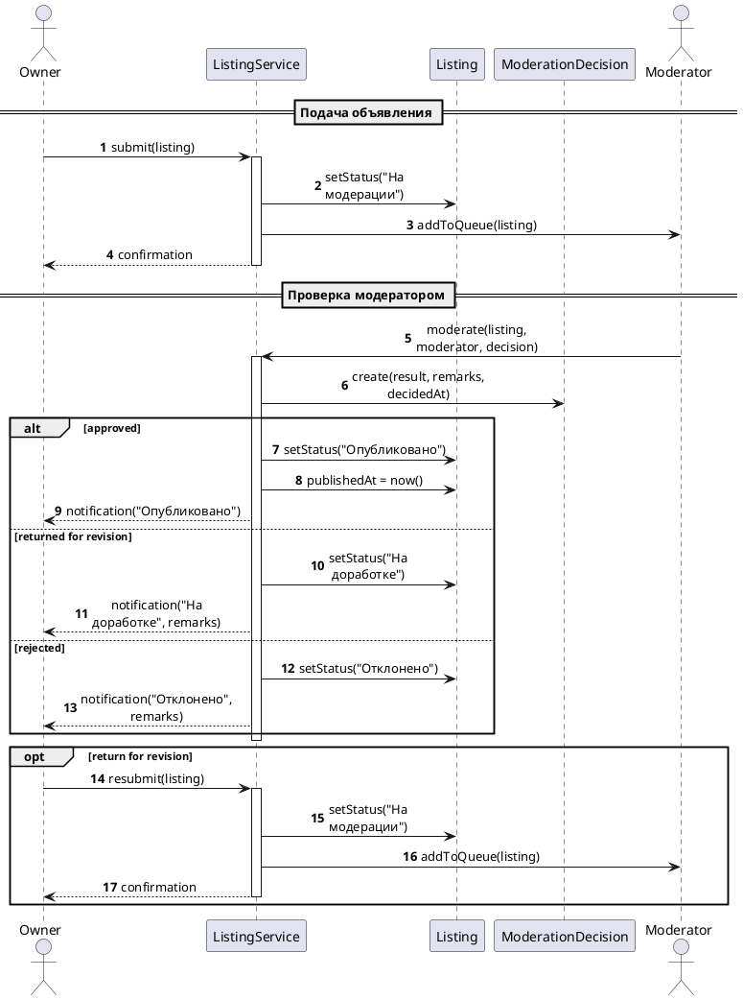

# Диаграмма последовательностей: размещение объявления и модерация

Участники соответствуют классам и акторам из `Диаграмма-классов.md`.

```plantuml
@startuml
skinparam sequenceMessageAlign center
skinparam maxMessageSize 160
autonumber

actor Owner
participant ListingService
participant Listing
participant ModerationDecision
actor Moderator

== Подача объявления ==

Owner -> ListingService: submit(listing)
activate ListingService
ListingService -> Listing: setStatus("На модерации")
ListingService -> Moderator: addToQueue(listing)
ListingService --> Owner: confirmation
deactivate ListingService

== Проверка модератором ==

Moderator -> ListingService: moderate(listing, moderator, decision)
activate ListingService
ListingService -> ModerationDecision: create(result, remarks, decidedAt)

alt approved
  ListingService -> Listing: setStatus("Опубликовано")
  ListingService -> Listing: publishedAt = now()
  ListingService --> Owner: notification("Опубликовано")
else returned for revision
  ListingService -> Listing: setStatus("На доработке")
  ListingService --> Owner: notification("На доработке", remarks)
else rejected
  ListingService -> Listing: setStatus("Отклонено")
  ListingService --> Owner: notification("Отклонено", remarks)
end
deactivate ListingService

opt return for revision

Owner -> ListingService: resubmit(listing)
activate ListingService
ListingService -> Listing: setStatus("На модерации")
ListingService -> Moderator: addToQueue(listing)
ListingService --> Owner: confirmation
deactivate ListingService

end

@enduml
```
