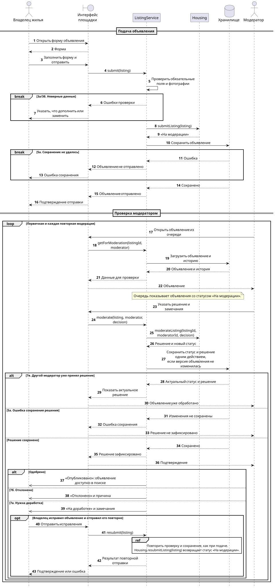
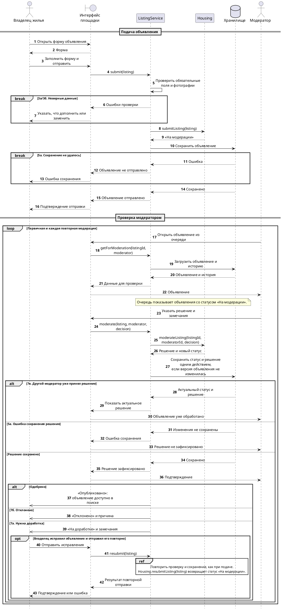

# 01. Размещение объявления и модерация

[Сценарий №01](../Прецеденты/01-Размещение-и-модерация.md) · [Диаграмма классов](../Диаграмма-классов.md)

Исходник PlantUML

```plantuml
@startuml
skinparam sequenceMessageAlign center
skinparam maxMessageSize 190
hide footbox
autonumber

actor "Владелец жилья" as Owner
boundary "Интерфейс\nплощадки" as UI
participant ListingService
participant Housing
database "Хранилище" as Store
actor "Модератор" as Moderator

== Подача объявления ==

Owner -> UI: Открыть форму объявления
UI --> Owner: Форма
Owner -> UI: Заполнить форму и отправить
UI -> ListingService: submit(listing)
ListingService -> ListingService: Проверить обязательные поля и фотографии
break 3а/3б. Неверные данные
  ListingService --> UI: Ошибки проверки
  UI --> Owner: Указать, что дополнить или заменить
end
ListingService -> Housing: submitListing(listing)
Housing --> ListingService: «На модерации»
ListingService -> Store: Сохранить объявление
break 5а. Сохранение не удалось
  Store --> ListingService: Ошибка
  ListingService --> UI: Объявление не отправлено
  UI --> Owner: Ошибка сохранения
end
Store --> ListingService: Сохранено
ListingService --> UI: Объявление отправлено
UI --> Owner: Подтверждение отправки

== Проверка модератором ==

loop Первичная и каждая повторная модерация
  Moderator -> UI: Открыть объявление из очереди
  UI -> ListingService: getForModeration(listingId, moderator)
  ListingService -> Store: Загрузить объявление и историю
  Store --> ListingService: Объявление и история
  ListingService --> UI: Данные для проверки
  UI --> Moderator: Объявление
  note over ListingService, Store
    Очередь показывает объявления со статусом «На модерации».
  end note

  Moderator -> UI: Указать решение и замечания
  UI -> ListingService: moderate(listing, moderator, decision)
  ListingService -> Housing: moderateListing(listingId, moderatorId, decision)
  Housing --> ListingService: Решение и новый статус
  ListingService -> Store: Сохранить статус и решение одним действием,\nесли версия объявления не изменилась
  alt 7в. Другой модератор уже принял решение
    Store --> ListingService: Актуальный статус и решение
    ListingService --> UI: Показать актуальное решение
    UI --> Moderator: Объявление уже обработано
  else 5а. Ошибка сохранения решения
    Store --> ListingService: Изменения не сохранены
    ListingService --> UI: Ошибка сохранения
    UI --> Moderator: Решение не зафиксировано
  else Решение сохранено
    Store --> ListingService: Сохранено
    ListingService --> UI: Решение зафиксировано
    UI --> Moderator: Подтверждение
    alt Одобрено
      ListingService ->> Owner: «Опубликовано»: объявление доступно в поиске
    else 7б. Отклонено
      ListingService ->> Owner: «Отклонено» и причина
    else 7а. Нужна доработка
      ListingService ->> Owner: «На доработке» и замечания
      opt Владелец исправил объявление и отправил его повторно
        Owner -> UI: Отправить исправления
        UI -> ListingService: resubmit(listing)
        ref over ListingService, Store
          Повторить проверку и сохранение, как при подаче.
          Housing.resubmitListing(listing) возвращает статус «На модерации».
        end ref
        ListingService --> UI: Результат повторной отправки
        UI --> Owner: Подтверждение или ошибка
      end
    end
  end
end
@enduml
```

