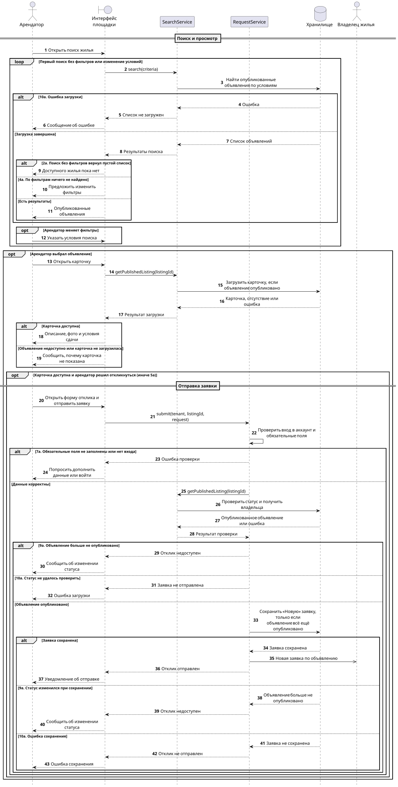
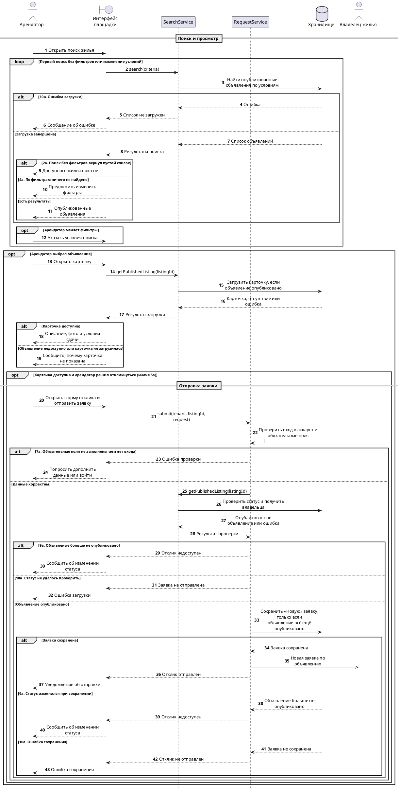

# 02. Поиск жилья и отклик на объявление

[Сценарий №02](../Прецеденты/02-Поиск-и-отклик.md) · [Диаграмма классов](../Диаграмма-классов.md)

Исходник PlantUML

```plantuml
@startuml
skinparam sequenceMessageAlign center
skinparam maxMessageSize 190
hide footbox
autonumber

actor "Арендатор" as Tenant
boundary "Интерфейс\nплощадки" as UI
participant SearchService
participant RequestService
database "Хранилище" as Store
actor "Владелец жилья" as Owner

== Поиск и просмотр ==

Tenant -> UI: Открыть поиск жилья
loop Первый поиск без фильтров или изменение условий
  UI -> SearchService: search(criteria)
  SearchService -> Store: Найти опубликованные объявления по условиям
  alt 10а. Ошибка загрузки
    Store --> SearchService: Ошибка
    SearchService --> UI: Список не загружен
    UI --> Tenant: Сообщение об ошибке
  else Загрузка завершена
    Store --> SearchService: Список объявлений
    SearchService --> UI: Результаты поиска
    alt 2а. Поиск без фильтров вернул пустой список
      UI --> Tenant: Доступного жилья пока нет
    else 4а. По фильтрам ничего не найдено
      UI --> Tenant: Предложить изменить фильтры
    else Есть результаты
      UI --> Tenant: Опубликованные объявления
    end
  end
  opt Арендатор меняет фильтры
    Tenant -> UI: Указать условия поиска
  end
end

opt Арендатор выбрал объявление
  Tenant -> UI: Открыть карточку
  UI -> SearchService: getPublishedListing(listingId)
  SearchService -> Store: Загрузить карточку, если объявление опубликовано
  Store --> SearchService: Карточка, отсутствие или ошибка
  SearchService --> UI: Результат загрузки
  alt Карточка доступна
    UI --> Tenant: Описание, фото и условия сдачи
  else Объявление недоступно или карточка не загрузилась
    UI --> Tenant: Сообщить, почему карточка не показана
  end

  opt Карточка доступна и арендатор решил откликнуться (иначе 5а)
    == Отправка заявки ==
    Tenant -> UI: Открыть форму отклика и отправить заявку
    UI -> RequestService: submit(tenant, listingId, request)
    RequestService -> RequestService: Проверить вход в аккаунт и обязательные поля
    alt 7а. Обязательные поля не заполнены или нет входа
      RequestService --> UI: Ошибка проверки
      UI --> Tenant: Попросить дополнить данные или войти
    else Данные корректны
      RequestService -> SearchService: getPublishedListing(listingId)
      SearchService -> Store: Проверить статус и получить владельца
      Store --> SearchService: Опубликованное объявление или ошибка
      SearchService --> RequestService: Результат проверки
      alt 9а. Объявление больше не опубликовано
        RequestService --> UI: Отклик недоступен
        UI --> Tenant: Сообщить об изменении статуса
      else 10а. Статус не удалось проверить
        RequestService --> UI: Заявка не отправлена
        UI --> Tenant: Ошибка загрузки
      else Объявление опубликовано
        RequestService -> Store: Сохранить «Новую» заявку, только если\nобъявление всё ещё опубликовано
        alt Заявка сохранена
          Store --> RequestService: Заявка сохранена
          RequestService ->> Owner: Новая заявка по объявлению
          RequestService --> UI: Отклик отправлен
          UI --> Tenant: Уведомление об отправке
        else 9а. Статус изменился при сохранении
          Store --> RequestService: Объявление больше не опубликовано
          RequestService --> UI: Отклик недоступен
          UI --> Tenant: Сообщить об изменении статуса
        else 10а. Ошибка сохранения
          Store --> RequestService: Заявка не сохранена
          RequestService --> UI: Отклик не отправлен
          UI --> Tenant: Ошибка сохранения
        end
      end
    end
  end
end
@enduml
```

