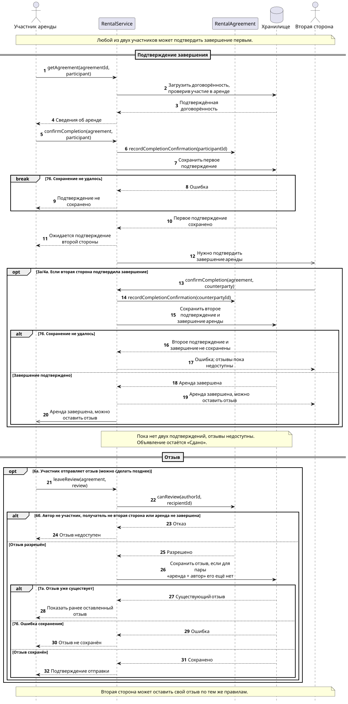
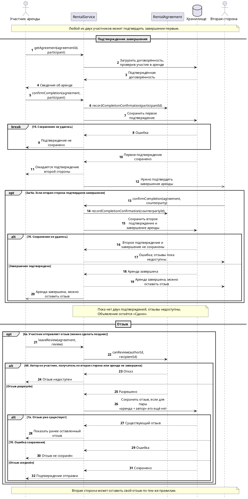

# 04. Подтверждение завершения аренды и оставление отзыва

Исходник PlantUML

```plantuml
@startuml
skinparam sequenceMessageAlign center
skinparam maxMessageSize 190
hide footbox
autonumber

actor "Участник аренды" as Participant
participant RentalService
participant RentalAgreement
database "Хранилище" as Store
actor "Вторая сторона" as Counterparty

note over Participant, Counterparty
  Любой из двух участников может подтвердить завершение первым.
end note

== Подтверждение завершения ==

Participant -> RentalService: getAgreement(agreementId, participant)
RentalService -> Store: Загрузить договорённость, проверив участие в аренде
Store --> RentalService: Подтверждённая договорённость
RentalService --> Participant: Сведения об аренде
Participant -> RentalService: confirmCompletion(agreement, participant)
RentalService -> RentalAgreement: recordCompletionConfirmation(participantId)
RentalService -> Store: Сохранить первое подтверждение
break 7б. Сохранение не удалось
  Store --> RentalService: Ошибка
  RentalService --> Participant: Подтверждение не сохранено
end
Store --> RentalService: Первое подтверждение сохранено
RentalService --> Participant: Ожидается подтверждение второй стороны
RentalService ->> Counterparty: Нужно подтвердить завершение аренды

opt 3а/4а. Если вторая сторона подтвердила завершение
  Counterparty -> RentalService: confirmCompletion(agreement, counterparty)
  RentalService -> RentalAgreement: recordCompletionConfirmation(counterpartyId)
  RentalService -> Store: Сохранить второе подтверждение и завершение аренды
  alt 7б. Сохранение не удалось
    Store --> RentalService: Второе подтверждение и завершение не сохранены
    RentalService --> Counterparty: Ошибка; отзывы пока недоступны
  else Завершение подтверждено
    Store --> RentalService: Аренда завершена
    RentalService --> Counterparty: Аренда завершена, можно оставить отзыв
    RentalService ->> Participant: Аренда завершена, можно оставить отзыв
  end
end
note over RentalService, Store
  Пока нет двух подтверждений, отзывы недоступны.
  Объявление остаётся «Сдано».
end note

== Отзыв ==

opt 6а. Участник отправляет отзыв (можно сделать позднее)
  Participant -> RentalService: leaveReview(agreement, review)
  RentalService -> RentalAgreement: canReview(authorId, recipientId)
  alt 6б. Автор не участник, получатель не вторая сторона или аренда не завершена
    RentalAgreement --> RentalService: Отказ
    RentalService --> Participant: Отзыв недоступен
  else Отзыв разрешён
    RentalAgreement --> RentalService: Разрешено
    RentalService -> Store: Сохранить отзыв, если для пары\n«аренда + автор» его ещё нет
    alt 7а. Отзыв уже существует
      Store --> RentalService: Существующий отзыв
      RentalService --> Participant: Показать ранее оставленный отзыв
    else 7б. Ошибка сохранения
      Store --> RentalService: Ошибка
      RentalService --> Participant: Отзыв не сохранён
    else Отзыв сохранён
      Store --> RentalService: Сохранено
      RentalService --> Participant: Подтверждение отправки
    end
  end
end
note over Participant, Counterparty
  Вторая сторона может оставить свой отзыв по тем же правилам.
end note
@enduml
```

