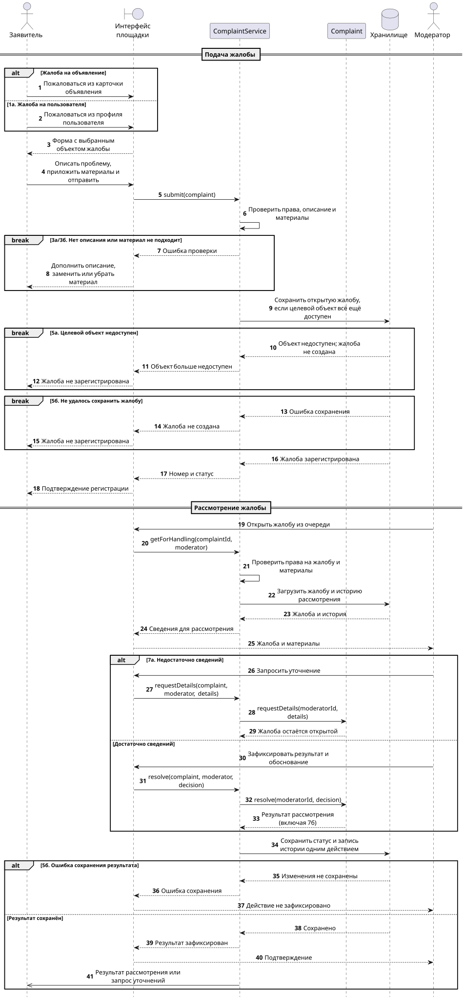
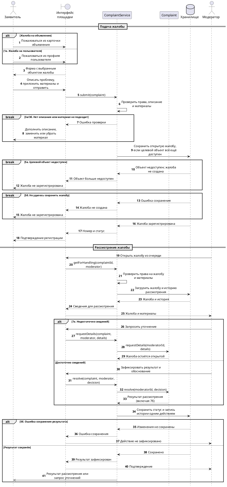

# 05. Подача и рассмотрение жалобы

[Сценарий №05](../Прецеденты/05-Жалоба.md) · [Диаграмма классов](../Диаграмма-классов.md)

Исходник PlantUML

```plantuml
@startuml
skinparam sequenceMessageAlign center
skinparam maxMessageSize 190
hide footbox
autonumber

actor "Заявитель" as Reporter
boundary "Интерфейс\nплощадки" as UI
participant ComplaintService
participant Complaint
database "Хранилище" as Store
actor "Модератор" as Moderator

== Подача жалобы ==

alt Жалоба на объявление
  Reporter -> UI: Пожаловаться из карточки объявления
else 1а. Жалоба на пользователя
  Reporter -> UI: Пожаловаться из профиля пользователя
end
UI --> Reporter: Форма с выбранным объектом жалобы
Reporter -> UI: Описать проблему, приложить материалы и отправить
UI -> ComplaintService: submit(complaint)
ComplaintService -> ComplaintService: Проверить права, описание и материалы
break 3а/3б. Нет описания или материал не подходит
  ComplaintService --> UI: Ошибка проверки
  UI --> Reporter: Дополнить описание, заменить или убрать материал
end
ComplaintService -> Store: Сохранить открытую жалобу,\nесли целевой объект всё ещё доступен
break 5а. Целевой объект недоступен
  Store --> ComplaintService: Объект недоступен; жалоба не создана
  ComplaintService --> UI: Объект больше недоступен
  UI --> Reporter: Жалоба не зарегистрирована
end
break 5б. Не удалось сохранить жалобу
  Store --> ComplaintService: Ошибка сохранения
  ComplaintService --> UI: Жалоба не создана
  UI --> Reporter: Жалоба не зарегистрирована
end
Store --> ComplaintService: Жалоба зарегистрирована
ComplaintService --> UI: Номер и статус
UI --> Reporter: Подтверждение регистрации

== Рассмотрение жалобы ==

Moderator -> UI: Открыть жалобу из очереди
UI -> ComplaintService: getForHandling(complaintId, moderator)
ComplaintService -> ComplaintService: Проверить права на жалобу и материалы
ComplaintService -> Store: Загрузить жалобу и историю рассмотрения
Store --> ComplaintService: Жалоба и история
ComplaintService --> UI: Сведения для рассмотрения
UI --> Moderator: Жалоба и материалы
alt 7а. Недостаточно сведений
  Moderator -> UI: Запросить уточнение
  UI -> ComplaintService: requestDetails(complaint, moderator, details)
  ComplaintService -> Complaint: requestDetails(moderatorId, details)
  Complaint --> ComplaintService: Жалоба остаётся открытой
else Достаточно сведений
  Moderator -> UI: Зафиксировать результат и обоснование
  UI -> ComplaintService: resolve(complaint, moderator, decision)
  ComplaintService -> Complaint: resolve(moderatorId, decision)
  Complaint --> ComplaintService: Результат рассмотрения (включая 7б)
end
ComplaintService -> Store: Сохранить статус и запись истории одним действием
alt 5б. Ошибка сохранения результата
  Store --> ComplaintService: Изменения не сохранены
  ComplaintService --> UI: Ошибка сохранения
  UI --> Moderator: Действие не зафиксировано
else Результат сохранён
  Store --> ComplaintService: Сохранено
  ComplaintService --> UI: Результат зафиксирован
  UI --> Moderator: Подтверждение
  ComplaintService ->> Reporter: Результат рассмотрения или запрос уточнений
end
@enduml
```

